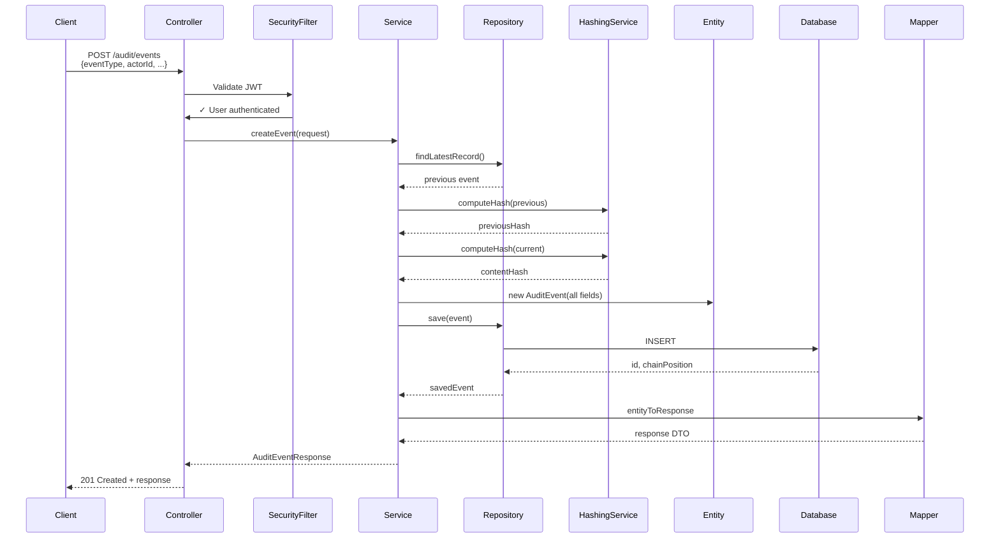
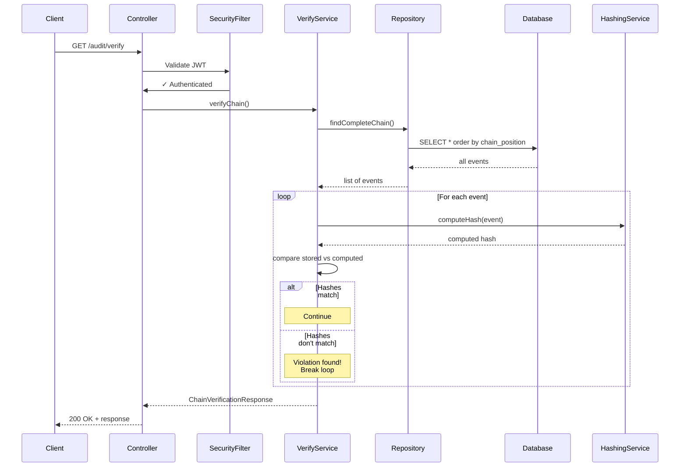
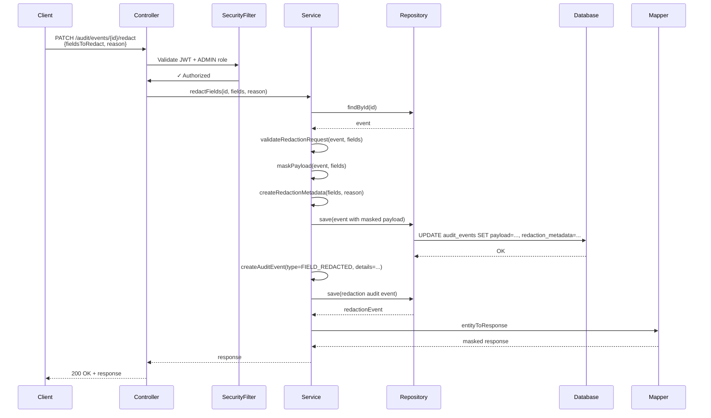

# 2. Solution Design — Audit Log Service

## 2.1 Overall Architecture

**Architecture Pattern:** Modular Monolith (Spring Boot)

**Design Principles:**
- Layered architecture (Controller → Service → Repository → Entity)
- Clean separation of concerns
- DTO/Entity boundary for API isolation
- Centralized exception handling
- Spring Security for authentication/authorization
- JPA for ORM with careful N+1 prevention
- Transaction-scoped operations for atomic writes

**Technology Choices:**
- **Framework:** Spring Boot 3.x (LTS)
- **Database:** H2 (embedded, in-memory for development; compatible with PostgreSQL migrations)
- **Security:** Spring Security 6.x + JWT (Stateless)
- **Validation:** Jakarta Bean Validation (annotations)
- **Hashing:** Java MessageDigest (SHA-256)
- **Testing:** JUnit 5 + Mockito + MockMvc
- **Documentation:** OpenAPI 3.0 (Springdoc-OpenAPI)
- **Build:** Maven

---

## 2.2 Package Structure

```
src/main/java/com/schwab/audit/
├── AuditLogServiceApplication.java              # Spring Boot entry point
│
├── config/
│   ├── SecurityConfig.java                      # Spring Security configuration
│   ├── JwtConfig.java                           # JWT bean configuration
│   ├── JpaConfig.java                           # JPA/Hibernate tuning
│   ├── OpenApiConfig.java                       # Swagger/OpenAPI configuration
│   └── AsyncConfig.java                         # Async/threading for verification
│
├── controller/
│   ├── AuditEventController.java                # Write/Query APIs (SCN-A)
│   ├── ChainVerificationController.java         # Verify endpoint (SCN-A)
│   ├── RedactionController.java                 # Redaction API (SCN-B)
│   ├── ExportController.java                    # Export/Bulk endpoints (SCN-B)
│   └── ComplianceController.java                # Compliance reporting (SCN-C)
│
├── service/
│   ├── AuditEventService.java                   # Core event write/query logic
│   ├── ChainVerificationService.java            # Hash chain verification
│   ├── HashingService.java                      # SHA-256 computation
│   ├── RedactionService.java                    # Field redaction logic (SCN-B)
│   ├── ArchiveService.java                      # Record archival (SCN-B)
│   ├── ExportService.java                       # Bundle export (SCN-B)
│   ├── ComplianceReportService.java             # Compliance queries (SCN-C)
│   └── AuthenticationService.java               # User auth (login, token)
│
├── repository/
│   ├── AuditEventRepository.java                # JPA repository with custom queries
│   ├── ChainVerificationRepository.java         # (optional) cached verification state
│   └── AuditEventSpecifications.java            # JPA Criteria/Spec for dynamic queries
│
├── entity/
│   ├── AuditEvent.java                          # JPA entity (immutable except archive/redact)
│   ├── User.java                                # User entity for authentication
│   ├── enums/
│   │   ├── EventType.java                       # Enum for known event types
│   │   ├── ResourceType.java                    # Enum for known resource types
│   │   ├── ViolationType.java                   # Enum for chain violation types
│   │   ├── UserRole.java                        # Enum for authorization roles
│   │   └── ArchivePolicy.java                   # Enum for retention policies (SCN-B)
│   └── AuditableEntity.java                     # Abstract base with createdAt/updatedAt
│
├── dto/
│   ├── request/
│   │   ├── CreateAuditEventRequest.java         # POST /audit/events
│   │   ├── RedactFieldsRequest.java             # PATCH /audit/events/{id}/redact
│   │   ├── ExportRequest.java                   # POST /audit/export
│   │   ├── ComplianceReportRequest.java         # GET /compliance/report
│   │   └── LoginRequest.java                    # POST /auth/login
│   │
│   ├── response/
│   │   ├── AuditEventResponse.java              # Serialized event (with hashes)
│   │   ├── ChainVerificationResponse.java       # Verify endpoint result
│   │   ├── PaginatedResponse.java               # Generic paginated wrapper
│   │   ├── ApiResponse.java                     # Generic success/error wrapper
│   │   ├── ErrorResponse.java                   # Structured error response
│   │   ├── ComplianceReportResponse.java        # Compliance report data (SCN-C)
│   │   ├── ExportBundleResponse.java            # Exported bundle metadata
│   │   └── LoginResponse.java                   # JWT token response
│   │
│   └── mapper/
│       ├── AuditEventMapper.java                # Entity ↔ DTO conversion
│       ├── ChainVerificationMapper.java         # Verification result mapping
│       └── ComplianceMapper.java                # Compliance DTO mapping
│
├── exception/
│   ├── GlobalExceptionHandler.java              # @RestControllerAdvice
│   ├── AuditException.java                      # Base custom exception
│   ├── InvalidEventException.java               # Validation failure
│   ├── ChainBrokenException.java                # Tampering detected
│   ├── ResourceNotFoundException.java           # 404 errors
│   ├── UnauthorizedException.java               # 401 errors
│   ├── ForbiddenException.java                  # 403 errors
│   ├── ConflictException.java                   # 409 errors (redaction conflicts, etc.)
│   ├── HashComputationException.java            # Cryptographic failure
│   └── ArchiveException.java                    # Archive/retention issues (SCN-B)
│
├── security/
│   ├── JwtAuthenticationFilter.java             # JWT validation filter
│   ├── JwtService.java                          # Token generation/validation
│   ├── CustomUserDetailsService.java            # UserDetailsService impl
│   ├── SecurityContextHelper.java               # Current user/role utilities
│   └── AuditableAspect.java                     # (Optional) audit of all API calls
│
├── validation/
│   ├── EventTypeValidator.java                  # Custom validator for eventType
│   ├── ResourceIdValidator.java                 # Custom validator for resourceId
│   ├── PayloadValidator.java                    # JSON payload validation
│   └── DateRangeValidator.java                  # from/to parameter validation
│
├── util/
│   ├── Constants.java                           # Constants (GENESIS_HASH, etc.)
│   ├── DateUtils.java                           # Date/time utilities
│   ├── JsonUtils.java                           # JSON parsing/serialization
│   └── LoggingUtils.java                        # Safe logging (no secrets)
│
└── listener/
    └── AuditEventListener.java                  # JPA events (pre/post persist)

src/main/resources/
├── application.properties                       # Main configuration
├── application-dev.properties                   # Development profile
├── application-test.properties                  # Test profile
├── db/migration/
│   ├── V1__initial_schema.sql                   # Scenario A baseline
│   ├── V2__add_archive_fields.sql               # Scenario B archival
│   ├── V3__add_redaction_metadata.sql           # Scenario B redaction
│   └── V4__add_compliance_indexes.sql           # Scenario C performance
│
└── openapi.yaml                                 # OpenAPI specification

src/test/java/com/schwab/audit/
├── unit/
│   ├── service/
│   │   ├── AuditEventServiceTest.java           # Service logic tests
│   │   ├── ChainVerificationServiceTest.java    # Verification tests
│   │   ├── HashingServiceTest.java              # Hashing algorithm tests
│   │   ├── RedactionServiceTest.java            # Redaction tests (SCN-B)
│   │   └── ComplianceReportServiceTest.java     # Compliance tests (SCN-C)
│   │
│   ├── validation/
│   │   └── EventValidationTest.java
│   │
│   └── security/
│       └── JwtServiceTest.java
│
├── integration/
│   ├── AuditEventControllerIntegrationTest.java # API integration tests
│   ├── ChainVerificationIntegrationTest.java    # Verify endpoint tests
│   ├── RedactionIntegrationTest.java            # Redaction workflow (SCN-B)
│   ├── ExportIntegrationTest.java               # Export workflow (SCN-B)
│   └── ComplianceIntegrationTest.java           # Compliance endpoint (SCN-C)
│
├── testdata/
│   └── TestDataFactory.java                     # Test event builders
│
└── fixture/
    └── DatabaseFixture.java                     # Test database setup
```

---

## 2.3 Layered Architecture

### Controller Layer (REST API Boundary)

**Responsibilities:**
- Accept HTTP requests
- Parse/validate request parameters
- Delegate to service layer
- Format and return responses
- Handle authentication/authorization via annotations
- Translate exceptions to HTTP status codes

**Key Controllers:**
1. **AuditEventController**
   - `POST /api/v1/audit/events` — Create event
   - `GET /api/v1/audit/events` — Query with filters
   
2. **ChainVerificationController**
   - `GET /api/v1/audit/verify` — Verify chain integrity
   
3. **RedactionController** (SCN-B)
   - `PATCH /api/v1/audit/events/{id}/redact` — Redact sensitive fields
   
4. **ExportController** (SCN-B)
   - `POST /api/v1/audit/export` — Export bundle
   
5. **ComplianceController** (SCN-C)
   - `GET /api/v1/compliance/account-access-report` — Compliance report

**Pattern:**
```java
@RestController
@RequestMapping("/api/v1/audit")
@RequiredArgsConstructor
public class AuditEventController {
    private final AuditEventService auditEventService;
    private final AuditEventMapper mapper;
    
    @PostMapping("/events")
    @PreAuthorize("hasRole('AUDIT_WRITER')")
    public ResponseEntity<ApiResponse<AuditEventResponse>> createEvent(
        @Valid @RequestBody CreateAuditEventRequest request) {
        // Validate, delegate, respond
    }
}
```

---

### Service Layer (Business Logic)

**Responsibilities:**
- Implement business logic (domain rules)
- Orchestrate across repositories
- Manage transactions
- Perform validation beyond request-level
- Handle error scenarios
- NO direct HTTP concerns

**Key Services:**

#### AuditEventService
- `createEvent(request)`: Validate, compute hashes, persist
- `queryEvents(filter)`: Dynamic filtering, pagination
- `getEventById(id)`: Retrieve single event
- **Private methods:**
  - `computeContentHash(event)`: SHA-256 of event fields
  - `getLatestRecord()`: Retrieve last record for previousHash

#### ChainVerificationService
- `verifyChain()`: Walk full chain, detect breaks
- `isChainIntact()`: Boolean check
- `getFirstInconsistency()`: Detect and report violation

#### HashingService
- `computeSha256(content)`: Generic SHA-256 computation
- `computeEventHash(event)`: Event-specific hash
- `verifyHash(stored, computed)`: Comparison

#### RedactionService (SCN-B)
- `redactFields(eventId, fieldsToRedact, reason)`: Mark fields as redacted
- `applyRedaction(event)`: Show [REDACTED] in payload
- `validateRedaction(field)`: Prevent re-redaction

#### ArchiveService (SCN-B)
- `archiveOldRecords()`: Scheduled archival based on retention window
- `isArchived(event)`: Check status

#### ExportService (SCN-B)
- `exportByResourceId(resourceId)`: Bundle export
- `exportByActorId(actorId)`: Bundle export
- `createBundle(records)`: Add metadata, verification data

#### ComplianceReportService (SCN-C)
- `generateAccountAccessReport(filter)`: Compliance-ready report
- `filterComplianceEvents(criteria)`: Dynamic filtering

---

### Repository Layer (Data Access)

**Responsibilities:**
- Abstract database operations
- Query execution
- Transaction management (via Spring)
- NO business logic

**Key Repositories:**

#### AuditEventRepository (extends JpaRepository)
```java
public interface AuditEventRepository 
    extends JpaRepository<AuditEvent, Long>, 
            JpaSpecificationExecutor<AuditEvent> {
    
    Optional<AuditEvent> findLatestRecord();
    
    List<AuditEvent> findByActorId(String actorId, Pageable page);
    
    List<AuditEvent> findByResourceTypeAndResourceId(
        String resourceType, String resourceId, Pageable page);
    
    List<AuditEvent> findChainByPosition(long from, long to);
    
    // Custom queries for compliance
    List<AuditEvent> findCompleteChain();
}
```

**Dynamic Filtering (JPA Specifications):**
```java
public class AuditEventSpecifications {
    public static Specification<AuditEvent> byActorId(String actorId) { ... }
    public static Specification<AuditEvent> byResourceType(String type) { ... }
    public static Specification<AuditEvent> inDateRange(LocalDateTime from, LocalDateTime to) { ... }
    // Compose with: repository.findAll(Specification.where(...).and(...))
}
```

---

### Entity Layer (Data Model)

**Core Entity: AuditEvent**

```java
@Entity
@Table(name = "audit_events", indexes = {
    @Index(name = "idx_chain_position", columnList = "chain_position"),
    @Index(name = "idx_actor_id", columnList = "actor_id"),
    @Index(name = "idx_resource_type_id", columnList = "resource_type, resource_id"),
    @Index(name = "idx_event_type", columnList = "event_type"),
    @Index(name = "idx_timestamp", columnList = "timestamp"),
    @Index(name = "idx_archived", columnList = "archived")
})
@Data
@NoArgsConstructor
@AllArgsConstructor
public class AuditEvent {
    @Id
    @GeneratedValue(strategy = GenerationType.IDENTITY)
    private Long id;
    
    @Column(nullable = false, length = 100)
    private String eventType;
    
    @Column(nullable = false, length = 255)
    private String actorId;
    
    @Column(nullable = false, length = 100)
    private String resourceType;
    
    @Column(nullable = false, length = 255)
    private String resourceId;
    
    @Column(nullable = false, columnDefinition = "CLOB")
    private String payload;  // Stored as JSON string (CLOB for H2 compatibility)
    
    @Column(nullable = false)
    private LocalDateTime timestamp;
    
    @Column(nullable = false, length = 64)
    private String contentHash;  // SHA-256 hex
    
    @Column(nullable = false, length = 64)
    private String previousHash; // SHA-256 hex or GENESIS_HASH
    
    @Column(nullable = false, unique = true)
    private Long chainPosition;
    
    @Column(nullable = false)
    private Boolean archived = false;
    
    @Column
    private LocalDateTime archivedAt;
    
    @Column(columnDefinition = "CLOB")
    private String redactionMetadata;  // JSON tracking redacted fields (CLOB for H2 compatibility)
    
    @Column(nullable = false, updatable = false)
    private LocalDateTime createdAt;
    
    @Column
    private LocalDateTime updatedAt;
}
```

**Supporting Entities:**

```java
@Entity
@Table(name = "users")
public class User {
    @Id
    @GeneratedValue(strategy = GenerationType.IDENTITY)
    private Long id;
    
    @Column(unique = true, nullable = false)
    private String username;
    
    @Column(nullable = false)
    private String passwordHash;  // BCrypt
    
    @Enumerated(EnumType.STRING)
    private UserRole role;
    
    @Column(nullable = false)
    private LocalDateTime createdAt;
}
```

---

### DTO Layer (API Contracts)

**Request DTOs:**

```java
@Data
@NoArgsConstructor
public class CreateAuditEventRequest {
    @NotBlank(message = "eventType is required")
    @Pattern(regexp = "^[A-Z_]+$")
    @Size(max = 100)
    private String eventType;
    
    @NotBlank(message = "actorId is required")
    @Size(max = 255)
    private String actorId;
    
    @NotBlank(message = "resourceType is required")
    @Size(max = 100)
    private String resourceType;
    
    @NotBlank(message = "resourceId is required")
    @Size(max = 255)
    private String resourceId;
    
    @NotNull(message = "payload is required")
    private Map<String, Object> payload;
    
    @PastOrPresent(message = "timestamp cannot be in the future")
    private LocalDateTime timestamp;  // Optional
}
```

```java
@Data
public class RedactFieldsRequest {
    @NotEmpty(message = "fieldsToRedact cannot be empty")
    private List<String> fieldsToRedact;  // e.g., ["payload.ssn"]
    
    private String reason;
}
```

**Response DTOs:**

```java
@Data
public class AuditEventResponse {
    private Long id;
    private String eventType;
    private String actorId;
    private String resourceType;
    private String resourceId;
    private Map<String, Object> payload;  // Redacted values show [REDACTED]
    private LocalDateTime timestamp;
    private String contentHash;
    private String previousHash;
    private Long chainPosition;
    private Boolean archived;
    private LocalDateTime archivedAt;
    private RedactionMetadataResponse redactionMetadata;
    private LocalDateTime createdAt;
}
```

```java
@Data
public class ChainVerificationResponse {
    private Boolean isIntact;
    private Long firstInconsistency;
    private String violationType;  // CONTENT_HASH_MISMATCH, etc.
    private String violationDetails;
    private Long totalRecords;
    private LocalDateTime verifiedAt;
}
```

```java
@Data
public class ApiResponse<T> {
    private Boolean success;
    private String message;
    private T data;
    private LocalDateTime timestamp;
    private String path;  // For errors
    private String code;  // For errors
}
```

---

### Mapper Strategy

**Purpose:** Convert between entities and DTOs

**Tool:** Manual mappers or MapStruct (keep simple, avoid over-abstraction)

```java
@Component
@RequiredArgsConstructor
public class AuditEventMapper {
    
    public AuditEventResponse entityToResponse(AuditEvent entity) {
        // Apply redaction: if fields in redactionMetadata, show [REDACTED]
        Map<String, Object> displayPayload = applyRedactionMask(entity);
        
        return new AuditEventResponse(
            entity.getId(),
            entity.getEventType(),
            entity.getActorId(),
            entity.getResourceType(),
            entity.getResourceId(),
            displayPayload,
            entity.getTimestamp(),
            entity.getContentHash(),
            entity.getPreviousHash(),
            entity.getChainPosition(),
            entity.getArchived(),
            entity.getArchivedAt(),
            parseRedactionMetadata(entity.getRedactionMetadata()),
            entity.getCreatedAt()
        );
    }
    
    private Map<String, Object> applyRedactionMask(AuditEvent entity) {
        // If redactionMetadata exists, mask specified fields
        // Otherwise return original payload
    }
}
```

---

## 2.4 Security Architecture

### Authentication (JWT)

**Flow:**
1. Client sends credentials: `POST /api/v1/auth/login`
2. Server validates username/password (BCrypt)
3. Server generates JWT token (with user id, role, expiry)
4. Client includes token in subsequent requests: `Authorization: Bearer <token>`
5. JwtAuthenticationFilter intercepts, validates token
6. If valid, populates SecurityContext; if invalid, returns 401

**JWT Payload:**
```json
{
  "sub": "user123",
  "role": "AUDIT_WRITER",
  "exp": 1724077201,
  "iat": 1724073601
}
```

**Configuration:**
- Secret key: Environment variable (or application.properties in dev)
- Token TTL: 24 hours (configurable)
- Algorithm: HS256 (HMAC-SHA256)

### Authorization (Role-Based)

**Roles:**
| Role | Permissions | Endpoints |
|------|-------------|-----------|
| AUDIT_WRITER | Create events | POST /audit/events |
| AUDITOR | Read events, verify chain | GET /audit/events, GET /audit/verify, GET /compliance/* |
| ADMIN | All operations | All + PATCH (redact), POST (export), DELETE (archive) |

**Implementation:**
```java
@PreAuthorize("hasRole('AUDIT_WRITER')")
public ResponseEntity<...> createEvent(...) { }

@PreAuthorize("hasAnyRole('AUDITOR', 'ADMIN')")
public ResponseEntity<...> queryEvents(...) { }

@PreAuthorize("hasRole('ADMIN')")
public ResponseEntity<...> redactFields(...) { }
```

### Secured Endpoints (by default)

**Public (no auth):**
- `POST /api/v1/auth/login`
- `POST /api/v1/auth/register` (if enabled)

**Protected:**
- All `/audit/*` endpoints require JWT
- All `/compliance/*` endpoints require JWT + AUDITOR/ADMIN role

### Secure Practices

- No passwords in logs
- No JWT tokens in logs
- No sensitive data in error messages returned to client
- All user input validated
- HTTPS in production (enforced via config)
- CORS restricted
- CSRF disabled (stateless JWT)
- Password hashing: BCrypt (strength 12)

---

## 2.5 Database Design

### Schema Overview

**Naming Convention:** snake_case for columns, lowercase for tables

**audit_events Table (H2-compatible):**
```sql
CREATE TABLE audit_events (
    id BIGINT GENERATED BY DEFAULT AS IDENTITY PRIMARY KEY,
    event_type VARCHAR(100) NOT NULL,
    actor_id VARCHAR(255) NOT NULL,
    resource_type VARCHAR(100) NOT NULL,
    resource_id VARCHAR(255) NOT NULL,
    payload CLOB NOT NULL,
    timestamp TIMESTAMP NOT NULL,
    content_hash VARCHAR(64) NOT NULL UNIQUE,
    previous_hash VARCHAR(64) NOT NULL,
    chain_position BIGINT NOT NULL UNIQUE,
    archived BOOLEAN DEFAULT false,
    archived_at TIMESTAMP,
    redaction_metadata CLOB,
    created_at TIMESTAMP NOT NULL DEFAULT CURRENT_TIMESTAMP,
    updated_at TIMESTAMP
);

CREATE INDEX idx_chain_position ON audit_events(chain_position);
CREATE INDEX idx_actor_id ON audit_events(actor_id);
CREATE INDEX idx_resource_type_id ON audit_events(resource_type, resource_id);
CREATE INDEX idx_event_type ON audit_events(event_type);
CREATE INDEX idx_timestamp ON audit_events(timestamp);
CREATE INDEX idx_archived ON audit_events(archived);
```

**users Table:**
```sql
CREATE TABLE users (
    id BIGSERIAL PRIMARY KEY,
    username VARCHAR(100) UNIQUE NOT NULL,
    password_hash VARCHAR(255) NOT NULL,
    role VARCHAR(50) NOT NULL,
    created_at TIMESTAMP NOT NULL DEFAULT CURRENT_TIMESTAMP
);

CREATE INDEX idx_username ON users(username);
```

### Entity Relationships

```
users (1) -----> (many) audit_events
               (implicit: actor_id or actorId field)
```

*Note:* Currently no explicit foreign key (actor_id is string, not foreign key). For future enhancement, could add user tracking.

### Constraints

| Constraint | Type | Reason |
|-----------|------|--------|
| content_hash UNIQUE | Database | Prevent duplicate event storage |
| chain_position UNIQUE | Database | Enforce sequential positioning |
| event_type NOT NULL | Check/Domain | Every event must have a type |
| payload NOT NULL | Check/Domain | Payload is required |
| archived indexed | Performance | Retention queries filter by this |

### Indexes (for Query Performance)

1. **chain_position**: Used by verification (full table scan)
2. **actor_id**: Filter by actor (common query)
3. **(resource_type, resource_id)**: Composite index for resource queries
4. **event_type**: Filter by event type
5. **timestamp**: Range queries (from/to)
6. **archived**: Retention queries

### Audit Trail Strategy

All audit events are logged to the same `audit_events` table (self-referential auditing):
- When a redaction occurs → create a NEW audit event of type "FIELD_REDACTED"
- When an archive occurs → create a NEW audit event of type "RECORD_ARCHIVED"
- This maintains the append-only guarantee and chain integrity

---

## 2.6 API Design

### Base URL
```
/api/v1
```

### Common Response Format

**Success (201, 200):**
```json
{
  "success": true,
  "message": "Operation successful",
  "data": { ... },
  "timestamp": "2026-08-18T10:30:01Z"
}
```

**Error (4xx, 5xx):**
```json
{
  "success": false,
  "message": "Validation failed",
  "code": "INVALID_EVENT_TYPE",
  "timestamp": "2026-08-18T10:30:01Z",
  "path": "/api/v1/audit/events"
}
```

### Core APIs (Scenario A)

#### 1. Create Audit Event
```
POST /api/v1/audit/events
Authorization: Bearer <JWT>
Content-Type: application/json

{
  "eventType": "USER_LOGIN",
  "actorId": "user123",
  "resourceType": "USER_SESSION",
  "resourceId": "session456",
  "payload": { "ipAddress": "..." },
  "timestamp": "2026-08-18T10:30:00Z"
}

Response: 201 Created
{
  "success": true,
  "data": {
    "id": 42,
    "eventType": "USER_LOGIN",
    "contentHash": "abc123...",
    "previousHash": "def456...",
    "chainPosition": 1,
    ...
  }
}
```

#### 2. Query Events
```
GET /api/v1/audit/events?actorId=user123&from=2026-08-01T00:00:00Z&to=2026-08-31T23:59:59Z&page=0&size=20

Response: 200 OK
{
  "success": true,
  "data": {
    "content": [...],
    "pagination": {
      "page": 0,
      "size": 20,
      "totalElements": 450,
      "totalPages": 23
    }
  }
}
```

#### 3. Verify Chain
```
GET /api/v1/audit/verify

Response: 200 OK
{
  "success": true,
  "data": {
    "isIntact": true,
    "totalRecords": 450,
    "verifiedAt": "2026-08-18T10:30:01Z"
  }
}
```

### Extension APIs (Scenario B)

#### 4. Redact Fields
```
PATCH /api/v1/audit/events/{id}/redact
Authorization: Bearer <JWT>
Content-Type: application/json

{
  "fieldsToRedact": ["payload.ssn", "payload.accountNumber"],
  "reason": "PII redaction per GDPR"
}

Response: 200 OK
{
  "success": true,
  "data": {
    "id": 42,
    "payload": {
      "ssn": "[REDACTED]",
      "accountNumber": "[REDACTED]"
    },
    "redactionMetadata": {
      "redactedFields": [...],
      "redactionTime": "...",
      "redactionActor": "admin123"
    }
  }
}
```

#### 5. Export Bundle
```
POST /api/v1/audit/export
Authorization: Bearer <JWT>
Content-Type: application/json

{
  "resourceId": "resource123"
}

Response: 200 OK
Content-Type: application/json
Content-Disposition: attachment; filename="export_20260818.json"

{
  "success": true,
  "data": {
    "bundle": {
      "records": [...],
      "metadata": {
        "genesisHash": "...",
        "finalHash": "...",
        "recordCount": 42,
        "exportTime": "..."
      }
    }
  }
}
```

### Compliance APIs (Scenario C)

#### 6. Compliance Report
```
GET /api/v1/compliance/account-access-report?actorId=user123&from=2026-08-01T00:00:00Z&to=2026-08-31T23:59:59Z&eventTypes=READ_ACCOUNT,UPDATE_ACCOUNT

Response: 200 OK
{
  "success": true,
  "data": {
    "reportTitle": "Account Access Audit Report",
    "period": { "from": "...", "to": "..." },
    "records": [...],
    "statistics": {
      "totalAccess": 45,
      "readCount": 30,
      "updateCount": 15
    }
  }
}
```

### Authentication APIs

#### 7. Login
```
POST /api/v1/auth/login
Content-Type: application/json

{
  "username": "user123",
  "password": "secret"
}

Response: 200 OK
{
  "success": true,
  "data": {
    "token": "eyJhbGc...",
    "expiresIn": 86400
  }
}
```

---

## 2.7 Validation Strategy

### Request-Level Validation
- Bean Validation annotations (`@NotBlank`, `@Size`, etc.)
- Custom validators for domain-specific rules
- Centralized error handling (returns 400 Bad Request)

### Business-Level Validation
- Service layer checks (e.g., "event with this hash already exists")
- Domain rule enforcement
- Returns 409 Conflict or 400 Bad Request with code

### Database-Level Constraints
- NOT NULL, UNIQUE, indexes
- Database constraints for data integrity layer

### Validation Rules by Field
```java
// eventType: ^[A-Z_]{1,100}$
// actorId: 1-255 chars
// resourceType: 1-100 chars
// resourceId: 1-255 chars
// payload: valid JSON
// timestamp: ISO-8601 format, not in future
// from/to: ISO-8601, from <= to
// page: >= 0
// size: 1-100
```

---

## 2.8 Transaction Management

**Transaction Boundaries:**

| Operation | Scope | Isolation |
|-----------|-------|-----------|
| Create Event | Single transaction | READ_COMMITTED |
| Query Events | Single transaction | READ_COMMITTED |
| Verify Chain | Single transaction | READ_COMMITTED (can be long-running) |
| Redact Fields | Single transaction | SERIALIZABLE (to prevent concurrent updates) |
| Archive Records | Batch transaction | READ_COMMITTED |

**Configuration:**
```java
@Transactional(propagation = Propagation.REQUIRED, 
               isolation = Isolation.READ_COMMITTED)
public AuditEvent createEvent(CreateAuditEventRequest request) { ... }

@Transactional(propagation = Propagation.REQUIRES_NEW,
               isolation = Isolation.SERIALIZABLE)
public void redactFields(...) { ... }
```

---

## 2.9 Logging Strategy

**Safe Logging (NO SECRETS):**
```java
log.info("Creating audit event: eventType={}, resourceType={}, resourceId={}", 
    event.getEventType(), event.getResourceType(), event.getResourceId());

// DO NOT log:
// - payload (may contain sensitive data)
// - timestamp values that could be PII
// - JWT tokens
// - password hashes
```

**Log Levels:**
- INFO: API calls (with method, path, user), major operations
- DEBUG: Query details, hash computations (dev only)
- WARN: Retries, unusual conditions
- ERROR: Exceptions, failed operations

---

## 2.10 Configuration Strategy

**Application Properties:**
```properties
# Database
spring.datasource.url=jdbc:postgresql://localhost:5432/audit_log
spring.jpa.hibernate.ddl-auto=validate
spring.jpa.properties.hibernate.dialect=org.hibernate.dialect.PostgreSQL10Dialect

# Security
app.jwt.secret=<env-variable>
app.jwt.expiry-hours=24
app.security.password-encoder-strength=12

# Audit Retention (Scenario B)
app.audit.retention.days=365
app.audit.retention.policy=ARCHIVE

# Pagination
app.pagination.default-size=20
app.pagination.max-size=100

# Server
server.servlet.context-path=/
server.port=8080
```

**Profiles:**
- `dev`: H2 in-memory (for rapid testing), debug logging
- `test`: PostgreSQL testcontainer or embedded
- `prod`: PostgreSQL production, info logging, no debug

---

## 2.11 Exception Handling

**Global Exception Handler:**

```java
@RestControllerAdvice
@Slf4j
public class GlobalExceptionHandler {
    
    @ExceptionHandler(MethodArgumentNotValidException.class)
    public ResponseEntity<ErrorResponse> handleValidationErrors(
        MethodArgumentNotValidException ex, HttpServletRequest request) {
        // Extract field errors, build error response
        return ResponseEntity.status(400).body(new ErrorResponse(...));
    }
    
    @ExceptionHandler(InvalidEventException.class)
    public ResponseEntity<ErrorResponse> handleInvalidEvent(
        InvalidEventException ex, HttpServletRequest request) {
        return ResponseEntity.status(400).body(new ErrorResponse(...));
    }
    
    @ExceptionHandler(ChainBrokenException.class)
    public ResponseEntity<ErrorResponse> handleChainBroken(
        ChainBrokenException ex, HttpServletRequest request) {
        // Chain tampering detected; return 400 (validation) or 409 (conflict)?
        // Assume 409 CONFLICT
        return ResponseEntity.status(409).body(new ErrorResponse(...));
    }
    
    @ExceptionHandler(ResourceNotFoundException.class)
    public ResponseEntity<ErrorResponse> handleNotFound(...) {
        return ResponseEntity.status(404).body(...);
    }
    
    @ExceptionHandler(Exception.class)
    public ResponseEntity<ErrorResponse> handleUnexpected(...) {
        log.error("Unexpected exception", ex);
        return ResponseEntity.status(500).body(
            new ErrorResponse("INTERNAL_ERROR", "An unexpected error occurred"));
    }
}
```

**Custom Exceptions:**

| Exception | HTTP Status | Use Case |
|-----------|----------|----------|
| InvalidEventException | 400 | Validation fails (invalid eventType, etc.) |
| ChainBrokenException | 409 | Tampering detected during verification |
| ResourceNotFoundException | 404 | Event not found |
| UnauthorizedException | 401 | No JWT token or invalid token |
| ForbiddenException | 403 | Insufficient permissions |
| ConflictException | 409 | Duplicate, constraint violation |
| HashComputationException | 500 | Internal hashing failure |

---

## 2.12 Sequence Diagrams

### SCN-A1: Create Audit Event



### SCN-A3: Verify Chain



### SCN-B2: Redact Fields



---

## 2.13 Summary

This design provides:

1. **Clean Layering**: Controller → Service → Repository → Entity
2. **Security**: Spring Security + JWT (stateless)
3. **Append-Only Contract**: No update/delete APIs
4. **Hash Chain**: Every record links to previous via SHA-256
5. **Extensibility**: Scenario B (redaction/retention), Scenario C (compliance) built on core
6. **Quality**: JPA with proper indexing, validation, exception handling
7. **Testability**: Service/Repository/Controller separation enables unit/integration tests
8. **Production-Ready**: Proper logging, configuration, error handling

